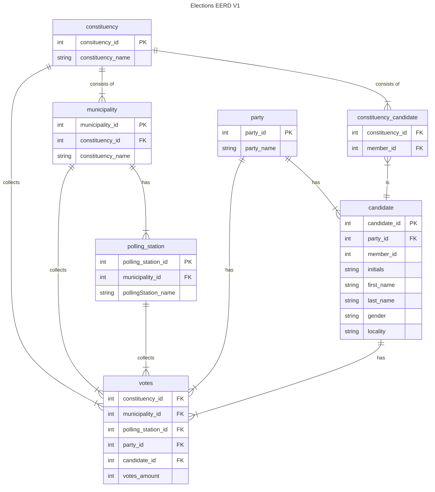
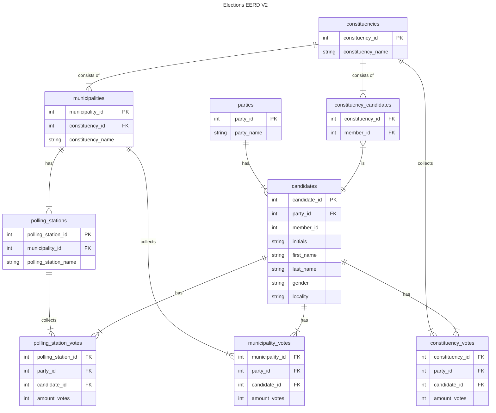

```mermaid
---
title: Elections EERD V1
---
erDiagram
    constituency ||--|{ municipality : "consists of"
    municipality ||--|{ polling_station : has
    party ||--|{ candidate : has
    constituency ||--|{ constituency_candidate : "consists of"
    constituency_candidate }|--|| candidate : is
    constituency ||--|{ votes : collects
    municipality ||--|{ votes : collects
    polling_station ||--|{ votes : collects
    party ||--|{ votes : has
    candidate ||--|{ votes : has
    
    constituency {
        int consituency_id PK
        string constituency_name
    }
    
    municipality {
        int municipality_id PK
        int constituency_id FK
        string constituency_name
    }
    
    polling_station {
        int polling_station_id PK
        int municipality_id FK
        string pollingStation_name
    }
    
    party {
        int party_id PK
        string party_name
    }
    
    candidate {
        int candidate_id PK
        int party_id FK
        int member_id
        string initials
        string first_name
        string last_name
        string gender
        string locality
    }
    
    constituency_candidate {
        int constituency_id FK
        int member_id FK
    }
    
    votes {
        int constituency_id FK
        int municipality_id FK
        int polling_station_id FK
        int party_id FK
        int candidate_id FK
        int votes_amount
    }
```

```mermaid
---
title: Elections EERD V2
---
erDiagram
    constituencies ||--|{ municipalities : "consists of"
    municipalities ||--|{ polling_stations : has
    parties ||--|{ candidates : has
    constituencies ||--|{ constituency_candidates : "consists of"
    constituency_candidates }|--|| candidates : is
    constituencies ||--|{ constituency_votes : collects
    municipalities ||--|{ municipality_votes : collects
    polling_stations ||--|{ polling_station_votes : collects
    candidates ||--|{ constituency_votes : has
    candidates ||--|{ municipality_votes : has
    candidates ||--|{ polling_station_votes : has
    
    constituencies {
        int consituency_id PK
        string constituency_name
    }
    
    municipalities {
        int municipality_id PK
        int constituency_id FK
        string constituency_name
    }
    
    polling_stations {
        int polling_station_id PK
        int municipality_id FK
        string polling_station_name
    }
    
    parties {
        int party_id PK
        string party_name
    }
    
    candidates {
        int candidate_id PK
        int party_id FK
        int member_id
        string initials
        string first_name
        string last_name
        string gender
        string locality
    }
    
    constituency_candidates {
        int constituency_id FK
        int member_id FK
    }
    
    constituency_votes {
        int constituency_id FK
        int party_id FK
        int candidate_id FK
        int amount_votes
    }
    
    municipality_votes {
        int municipality_id FK
        int party_id FK
        int candidate_id FK
        int amount_votes
    }
    
    polling_station_votes {
        int polling_station_id FK
        int party_id FK
        int candidate_id FK
        int amount_votes
    }
```