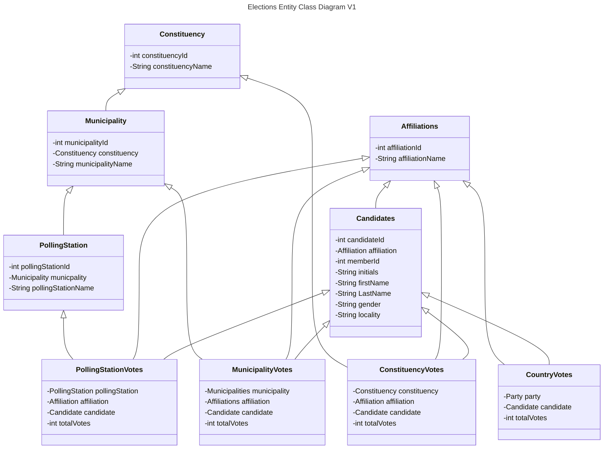

```mermaid
---
title: Elections Entity Class Diagram V1
---

classDiagram
    Constituency <|-- Municipality
    Municipality <|-- PollingStation
    
    Affiliations <|-- Candidates
    
    Affiliations <|-- CountryVotes
    Candidates <|-- CountryVotes
    
    Constituency <|-- ConstituencyVotes
    Affiliations <|-- ConstituencyVotes
    Candidates <|-- ConstituencyVotes

    Municipality <|-- MunicipalityVotes
    Affiliations <|-- MunicipalityVotes
    Candidates <|-- MunicipalityVotes

    PollingStation <|-- PollingStationVotes
    Affiliations <|-- PollingStationVotes
    Candidates <|-- PollingStationVotes
    
    class Constituency {
        -int constituencyId
        -String constituencyName
    }
    class Municipality {
        -int municipalityId
        -Constituency constituency
        -String municipalityName
    }
    class PollingStation {
        -int pollingStationId
        -Municipality municpality
        -String pollingStationName
    }
    
    class Affiliations {
        -int affiliationId
        -String affiliationName
    }
    class Candidates {
        -int candidateId
        -Affiliation affiliation
        -int memberId
        -String initials
        -String firstName
        -String LastName
        -String gender
        -String locality
    }
    
    class CountryVotes {
        -Party party
        -Candidate candidate
        -int totalVotes
    }
    
    class ConstituencyVotes {
        -Constituency constituency
        -Affiliation affiliation
        -Candidate candidate
        -int totalVotes
    }
    class MunicipalityVotes {
        -Municipalities municipality
        -Affiliations affiliation
        -Candidate candidate
        -int totalVotes
    }
    class PollingStationVotes {
        -PollingStation pollingStation
        -Affiliation affiliation
        -Candidate candidate
        -int totalVotes
    }
```

Note: Link-table between Candidate and Constituency has been removed due to the ConstituencyVotes class linking these two classes as well as keeping track of the votes.